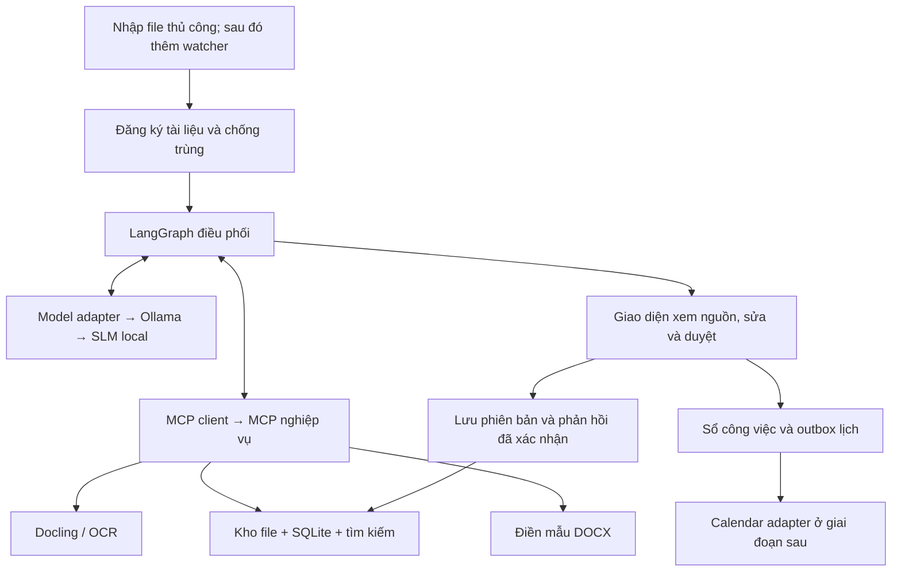

# Kế hoạch trợ lý xử lý văn bản: AI agent + SLM + MCP

Ngày đối chiếu nguồn: 08/09/2026. Trạng thái: đề xuất kỹ thuật; chưa cài đặt, chạy benchmark hoặc triển khai. Các đánh giá phù hợp bên dưới là nhận định thiết kế dựa trên README và tài liệu chính thức, chưa phải kết quả kiểm thử repo.

## 1. Quyết định đề xuất

Tạo repo ứng dụng riêng, tên gợi ý `tro-ly-van-ban`. Dùng thư viện upstream, khóa phiên bản sau thử nghiệm tương thích; không fork toàn bộ nền tảng để sửa nghiệp vụ. Một agent theo luồng có kiểm soát, một người dùng, một worker xử lý lần lượt là phạm vi ban đầu.

| Repo | Năng lực đã đối chiếu | Cách sử dụng đề xuất |
|---|---|---|
| [LangGraph](https://github.com/langchain-ai/langgraph) | Điều phối có trạng thái, persistence, human-in-the-loop; MIT | Lõi điều phối, dừng chờ duyệt và tiếp tục |
| [FastMCP](https://github.com/PrefectHQ/fastmcp) | Framework Python cho MCP server/client; Apache-2.0 | MCP nghiệp vụ với tập công cụ nhỏ |
| [Docling](https://github.com/docling-project/docling) | PDF, DOCX, cấu trúc bảng, OCR, chạy local; MIT | Bộ chuyển đổi tài liệu phía sau MCP |
| [Docling MCP](https://github.com/docling-project/docling-mcp) | Chuyển tài liệu qua MCP, cache, chế độ local/remote; MIT | Repo mẫu gần nhất cho khối đọc tài liệu qua MCP |
| [Ollama](https://github.com/ollama/ollama) | Chạy và cung cấp API model | Runtime cục bộ, đặt sau adapter để thay được |
| [python-docx-template](https://github.com/elapouya/python-docx-template) | Điền nội dung vào mẫu DOCX dùng Jinja2 | Xuất dự thảo từ mẫu bạn xác nhận |
| [Paperless-ngx](https://github.com/paperless-ngx/paperless-ngx) | Quét, lập chỉ mục và lưu trữ tài liệu | Lựa chọn bổ sung nếu cần kho tài liệu có giao diện sẵn |
| [Dify](https://github.com/langgenius/dify) | Workflow trực quan, RAG, model và công cụ | Phương án thay thế nếu ưu tiên cấu hình qua giao diện |
| [RAGFlow](https://github.com/infiniflow/ragflow) | RAG tài liệu, nguồn trích dẫn, agent và MCP | Xem xét khi tìm kiếm kho hồ sơ trở thành nhu cầu chính |

Dify dùng giấy phép riêng dựa trên Apache 2.0 với điều kiện bổ sung. RAGFlow nêu tối thiểu 4 lõi CPU, 16 GB RAM, 50 GB đĩa; đó không phải ngân sách đủ cho toàn hệ thống kèm SLM. Với phạm vi một người dùng và một mẫu, chưa cần đưa cả hai vào stack.

Docling MCP hiện có ma trận tương thích SDK và mặc định chế độ remote trong tài liệu. Nếu tái sử dụng phải cấu hình local rõ ràng, giới hạn nguồn đầu vào, khóa phiên bản phù hợp. Phương án ưu tiên là gọi thư viện Docling bên trong MCP nghiệp vụ; không chạy thêm một server chuyển đổi nếu chưa có lợi ích đo được. [Nguồn](https://github.com/docling-project/docling-mcp)

## 2. Kiến trúc



Agent gọi model trực tiếp qua adapter; không bắt buộc bọc lời gọi model trong MCP. MCP chuẩn hóa công cụ, còn quyền truy cập phải do server và hệ điều hành thực thi. SLM đề xuất dữ liệu có cấu trúc; mã ứng dụng kiểm tra rồi mới chọn nhánh và thực hiện công cụ.

Đề xuất Python, Pydantic, LangGraph, FastMCP, Docling, SQLite và giao diện web nhỏ bằng FastAPI với trang server-rendered. Phiên bản Python và dependency chốt sau smoke test tương thích. Chưa thêm Redis, Celery hoặc vector database vào MVP. Tìm hồ sơ bằng số ký hiệu, đơn vị, loại việc, thời gian và tìm kiếm toàn văn; đánh giá truy hồi rồi mới thêm embedding tiếng Việt.

Chạy các dịch vụ trên cùng máy qua localhost/stdio ở bản đầu. Nếu máy phụ khác máy đặt thư mục: cần chốt cơ chế đồng bộ hoặc mount trước, không tự giả định đường dẫn Windows truy cập được từ Linux. DB đang hoạt động nằm trên đĩa local, không nằm trong thư mục OneDrive đang đồng bộ. Sao lưu DB bằng snapshot nhất quán.

## 3. Phạm vi nghiệp vụ và dữ liệu

MVP nhận PDF có chữ, PDF scan và DOCX; một loại mẫu được chọn cùng bạn. File DOC cũ, file có mật khẩu, chữ viết tay và tài liệu quá lớn phải báo trạng thái cụ thể; chỉ bổ sung chuyển đổi khi có mẫu để kiểm thử.

Ba đầu ra: phiếu xử lý, danh sách đầu việc đề xuất, dự thảo DOCX. Có bản JSON để kiểm tra bằng máy và lịch sử phiên bản để đối chiếu. Đề xuất công việc chưa đồng nghĩa với công việc đã được bạn xác nhận.

| Thực thể | Trường chính và nguyên tắc |
|---|---|
| Document | ID, SHA-256, tên gốc, đường dẫn kho, thời điểm nhận, phiên bản parser; giữ bản gốc |
| Evidence | document ID, phiên bản, trang PDF hoặc đoạn/bảng DOCX, trích đoạn, vị trí nếu có |
| Extraction | Số ký hiệu, cơ quan, ngày văn bản, yêu cầu, đối tượng, thiếu dữ liệu, nguồn từng trường |
| Case | Hồ sơ/đầu việc, quan hệ tài liệu, đơn vị, trạng thái; liên kết nhiều-nhiều |
| Task | Yêu cầu cụ thể, người/đơn vị dự kiến, hạn nguyên văn, hạn chuẩn hóa, quy tắc suy ra, trạng thái xác nhận |
| Draft | Phiên bản, template ID/version, nguồn sử dụng, chỗ thiếu, đường dẫn và hash sản phẩm |
| Approval | Người duyệt, thời điểm, hành động, phiên bản/hash được duyệt; sửa nội dung thì duyệt lại |
| Run / Audit | Run ID, bước, trạng thái, lỗi, lần thử, model digest, prompt version, thời gian; hạn chế log nội dung |
| Feedback | Bản trước/sau, lý do sửa, phạm vi áp dụng, người xác nhận; không tự đưa mọi sửa đổi thành quy tắc |
| Outbox / CalendarLink | Khóa chống trùng, task ID, calendar ID, event ID, trạng thái gửi và đối soát |

Không dùng số ký hiệu làm khóa trùng duy nhất. Hash phát hiện cùng file đổi tên; scan lại cùng văn bản có thể ra hash khác nên chỉ cảnh báo nghi trùng theo metadata và nội dung, không tự xóa/gộp.

Hạn công việc phải tách khỏi ngày ban hành và lịch nhắc. Lưu cả nguyên văn, ngày chuẩn hóa, căn cứ suy ra, múi giờ Asia/Ho_Chi_Minh. Với “trong 5 ngày làm việc kể từ khi nhận”, thiếu ngày nhận hoặc lịch ngày làm việc thì để chưa xác định. Với “khẩn”, không tự bịa ra một ngày. Nhiều nhiệm vụ trong một văn bản có thể có nhiều hạn khác nhau.

Không tạo số văn bản phát hành, người ký, số liệu hoặc căn cứ thiếu nguồn. Dùng dấu `[CẦN BỔ SUNG: ...]`. Hồ sơ cũ là tài liệu tham khảo, không tự coi là căn cứ hiện hành.

## 4. Công cụ MCP dự kiến

| Công cụ | Đầu vào chính | Kết quả / ràng buộc |
|---|---|---|
| read_document | document_id | Nội dung chuẩn hóa, nguồn, cảnh báo OCR; không nhận đường dẫn tùy ý |
| search_cases | bộ lọc, query, limit | Hồ sơ ứng viên và lý do khớp; không tự gộp |
| get_evidence | document_id, block_ids | Các đoạn đúng phạm vi, có giới hạn kích thước |
| list_templates | loại sản phẩm | Mẫu đã xác nhận và phiên bản |
| render_draft | draft_id, template_id, dữ liệu đã kiểm tra | File phiên bản mới trong thư mục đầu ra |
| save_task_proposal | extraction_id, tasks, operation_key | Đề xuất bền vững, không trùng khi retry |
| propose_reminder | task_id, thời điểm | Đề xuất lịch để hiển thị duyệt |

Hành động duyệt chỉ đến từ giao diện người dùng đã xác thực; không cho model tự gọi công cụ approve. Worker lịch chỉ đọc outbox đã được duyệt. Kiểm tra quyền, trạng thái và phiên bản ở server, không chỉ ở prompt. Không cung cấp shell, SQL tùy ý hay quyền đọc toàn bộ máy.

## 5. Luồng chạy và phục hồi

Luồng: nhận → chờ file ổn định → hash/đăng ký → đọc → kiểm tra chất lượng → trích xuất → kiểm tra schema/căn cứ → đề xuất hồ sơ và việc → lấy mẫu/nguồn → dự thảo → chờ duyệt → đã duyệt. Nhánh riêng: cần bổ sung, cần kiểm tra OCR, thất bại có thể thử lại, từ chối.

Watcher chỉ tạo job; worker có lease và khóa xử lý. Kết hợp sự kiện file với quét đối soát lúc khởi động để không bỏ sót. Bỏ qua file tạm; xác nhận file đã tải local và copy hoàn chỉnh. Cache theo hash tài liệu + phiên bản pipeline.

Checkpoint giúp khôi phục trạng thái, không thay thế giao dịch nghiệp vụ hoặc chống trùng tác động bên ngoài. Ghi draft bằng file tạm và đổi tên nguyên tử; có tác vụ đối soát nếu DB và file lệch nhau khi mất điện. [Tài liệu persistence](https://docs.langchain.com/oss/python/langgraph/persistence)

Lịch: commit bản ghi outbox cùng giao dịch duyệt; worker dùng event ID xác định ổn định từ tác vụ theo quy tắc API, lưu calendar/event ID. Nếu timeout sau tạo, truy vấn đối soát trước khi thử lại. Thay đổi hạn cập nhật sự kiện đã liên kết. Không suy diễn thông báo thành công khi chưa xác nhận. [Google Calendar](https://developers.google.com/workspace/calendar/api/guides/create-events)

## 6. Kế hoạch code theo PR

Ước lượng sơ bộ 5–8 tuần làm việc cho một người triển khai cùng bạn kiểm tra nghiệp vụ; không phải cam kết. Chốt lại sau thử OCR/model. PR sau dựa trên PR trước đã merge; nếu cần nhánh phụ thuộc phải ghi rõ base PR.

| PR | Công việc cụ thể | Điều kiện nghiệm thu |
|---|---|---|
| 01 — Đặc tả và bộ mẫu | Chốt máy, loại dự thảo, schema, trạng thái, quyền; tuyển 30–50 văn bản đã khử nhạy cảm; lập đáp án | Có ca PDF chữ/scan/DOCX, nhiều hạn, thiếu hạn, sửa đổi, trùng và thiếu phụ lục |
| 02 — Khung và lưu trữ | Cấu hình thư mục, migration SQLite, kho bản gốc, audit, import thủ công, CI, model giả lập | Nhập file đổi tên không nhân đôi; file sửa thành phiên bản mới; restore DB/kho được |
| 03 — Đọc qua MCP | MCP client/server, Docling adapter, OCR local, nguồn theo trang/đoạn, giới hạn tài nguyên | Đọc bộ mẫu; báo rõ trang lỗi; chặn đường dẫn ngoài phạm vi và symlink thoát phạm vi |
| 04 — Model và phiếu xử lý | Ollama adapter, JSON schema, kiểm tra nguồn, ngày tháng; tối đa 2 lần sửa output lỗi rồi chuyển kiểm tra | Đánh giá từng trường trên tập giữ lại; không tự biến thiếu dữ liệu thành dữ liệu thật |
| 05 — Điều phối và sổ việc | LangGraph, checkpoint, pause/resume, đề xuất hồ sơ, tác vụ, giới hạn vòng lặp | Tắt giữa bước và khởi động lại không nhân đôi tác vụ; chưa duyệt không thành đã duyệt |
| 06 — Truy hồi và dự thảo | Tìm metadata/toàn văn, chọn nguồn, template DOCX, đánh dấu thiếu, quản lý phiên bản | Dự thảo dùng đúng mẫu; dữ kiện truy ra nguồn; mẫu mở được và bố cục được kiểm tra |
| 07 — Giao diện duyệt | Danh sách hồ sơ, xem nguồn cạnh phiếu, sửa trường, duyệt đúng version, phản hồi xác nhận | Chặn duyệt phiên bản cũ; truy vết chỉnh sửa; đóng/mở ứng dụng vẫn còn trạng thái |
| 08 — Watcher | Chờ file ổn định, chống sự kiện lặp, scan đối soát, retry/backoff | Copy chậm, đổi tên, restart, OneDrive chưa tải đủ không gây xử lý thiếu hoặc trùng |
| 09 — Lịch | OAuth scope phù hợp, preview, outbox, create/update/reconcile | Mất mạng sau create không nhân đôi; sửa hạn cập nhật đúng event; không upload nội dung không được phép |
| 10 — Pilot và bàn giao | Benchmark, giới hạn mạng, backup/restore, hướng dẫn vận hành, rollback | Qua các tình huống lỗi, có báo cáo chất lượng và bạn xác nhận khả năng dùng thử |

MVP dùng thủ công đạt sau PR 07; tự động theo dõi và lịch là mốc tiếp theo. Lịch trình gợi ý: tuần 1 PR 01–02, tuần 2 PR 03–04, tuần 3 PR 05, tuần 4–5 PR 06–07, tuần 6 PR 08–09, phần còn lại pilot/sửa lỗi. Dành thêm thời gian nếu OCR hoặc mẫu phức tạp.

## 7. Đánh giá model và chất lượng

Ứng viên benchmark ban đầu: [Qwen3-4B](https://huggingface.co/Qwen/Qwen3-4B) và [Qwen3-8B](https://huggingface.co/Qwen/Qwen3-8B), tùy RAM/VRAM. Đây là mốc so sánh có model card, không khẳng định mới nhất hoặc tốt nhất tiếng Việt. Chốt model, lượng tử hóa, context và số job đồng thời bằng đo thực tế.

[Structured outputs của Ollama](https://docs.ollama.com/capabilities/structured-outputs) hỗ trợ ép schema; JSON đúng không bảo đảm nội dung đúng. Không coi điểm tự tin do model tự sinh là xác suất đã hiệu chỉnh.

Tách tập phát triển và tập giữ lại theo hồ sơ, tránh văn bản gần giống lọt sang cả hai. Đáp án do bạn xác nhận. Bộ 30–50 văn bản chỉ là vòng pilot, cần mở rộng trước khi tăng quyền tự động.

| Hạng mục | Phép đo / điều kiện đề xuất |
|---|---|
| OCR | Đo lỗi ký tự trên trang có bản chuẩn; thống kê riêng số ký hiệu, ngày và bảng; trang lỗi phải được cảnh báo |
| Trích xuất | Precision/recall theo trường và nhiệm vụ, tỷ lệ bỏ sót; công bố riêng PDF chữ và scan |
| Thời hạn | Mục tiêu ≥95% exact match trên ca có hạn xác định; không tự xác nhận ca mơ hồ; báo cả tỷ lệ cần người xử lý |
| Nguồn | 100% trường quan trọng có vị trí nguồn hoặc nhãn thiếu/suy luận; kiểm tra nguồn có thực sự hỗ trợ kết luận |
| Truy hồi | Recall@5 trên hồ sơ đã gán nhãn; xem các ca lấy nhầm mẫu/hồ sơ trước khi thêm vector search |
| Dự thảo | Chấm đúng yêu cầu, đúng mẫu, đủ nguồn, phần thiếu và thời gian bạn sửa; mọi lỗi bịa dữ kiện quan trọng phải sửa trước mở rộng |
| Độ bền | Không tạo trùng trong ca retry/restart/timeout; không duyệt thay người dùng; restore bảo toàn liên kết file–DB |
| Hiệu năng | Thời gian từng bước và p50/p95, RAM/VRAM đỉnh, token và context; ngưỡng tốc độ chốt sau biết máy |

Đánh giá lỗi theo thứ tự: đọc file → truy hồi → prompt/schema → model → fine-tune. Chỉ fine-tune khi có lỗi lặp lại và dữ liệu xác nhận đủ tốt; giữ tập kiểm tra độc lập và khả năng quay lại model trước.

## 8. Phạm vi dữ liệu và vận hành

Văn bản là dữ liệu không đáng tin về mặt chỉ dẫn: các câu trong tài liệu yêu cầu chạy lệnh, bỏ qua quy tắc hoặc gửi file ra ngoài không được biến thành hành động. Có ca kiểm thử prompt injection, file quá lớn, archive/path traversal và gọi tool sai trạng thái.

Mặc định chạy local, không bật cloud tracing hoặc fallback model bên ngoài. Tải model trước rồi kiểm thử chạy không mạng. Thư mục OneDrive trong ví dụ có thể đồng bộ ra cloud: phải chốt thư mục thực tế phù hợp với loại dữ liệu trước khi dùng hồ sơ thật. Calendar ban đầu chỉ dùng tiêu đề tối giản và hạn được phép đồng bộ. Token nằm ngoài Git và log.

Backup nhất quán DB, bản gốc, dự thảo và cấu hình; lưu model/prompt/template version để tái hiện. Chỉ mục tìm kiếm có thể dựng lại. Worker một job tại một thời điểm trước khi đo được dư tài nguyên.

## 9. Tổ chức repo và phối hợp chatbot

```text
src/tro_ly_van_ban/
  domain/          # schema, trạng thái, quy tắc nghiệp vụ
  workflow/        # graph và checkpoint
  mcp_server/      # công cụ, kiểm tra quyền
  adapters/        # docling, ollama, calendar, templates
  storage/         # DB, migration, kho file, outbox
  web/             # giao diện duyệt
  ingestion/       # nhập thủ công và watcher
tests/             # unit, integration, end-to-end và ca lỗi
evals/             # dữ liệu đã khử nhạy cảm, đáp án, báo cáo
templates/         # mẫu được phép đưa lên Git
docs/adr/          # quyết định kiến trúc và lý do
docs/handoffs/     # bàn giao theo tác vụ/PR
WORKLOG.md         # chỉ mục tiến độ và phần việc đang nhận
```

Mỗi tác vụ có Issue, nhánh `codex/...`, phạm vi file/module và trạng thái trước khi sửa. Trước khi code phải thuyết minh mục tiêu và kiểm thử. Bản ghi bàn giao có: Issue/PR, base commit, thay đổi, schema/API ảnh hưởng, kiểm thử và kết quả, hạn chế, cách rollback, việc còn lại. Kiểm tra task/PR đang mở trước khi nhận phần việc; dùng worktree riêng nếu có nhiều tác vụ, không cùng sửa migration/schema mà chưa phối hợp. Không đẩy văn bản thật, secrets hoặc DB lên GitHub. Tôi code và tạo PR; bạn merge.

Với phần khó về kiến trúc, API, khôi phục lỗi và đánh giá liên ngành, đề xuất dùng GPT-6 Astra mức high/xhigh trong môi trường Codex hiện có; đây là lựa chọn triển khai, tách biệt SLM chạy sản phẩm. Các module rõ đặc tả có thể dùng GPT-5.6 Sol. Không chuyển tài liệu thật sang model bên ngoài chỉ vì đang dùng model đó để viết code.

## 10. Thông tin cần để chốt bước triển khai

1. Máy phụ: hệ điều hành, CPU, RAM, GPU/VRAM, dung lượng trống; có thể chạy liên tục hay chỉ lúc làm việc.
2. Một loại dự thảo ưu tiên và số văn bản/ngày, độ dài, tỷ lệ scan; loại dữ liệu nào được phép đưa vào hệ thống.
3. Đường dẫn đầu vào/đầu ra thực tế và máy chứa file; đường dẫn Windows trong mô tả chưa được xác minh từ workspace Linux hiện tại.
4. Repo GitHub đích hoặc yêu cầu tạo repo riêng khi bắt đầu code. Chưa tạo repo/PR trong giai đoạn lập kế hoạch này.

Bước triển khai đầu tiên sau khi chốt các thông tin là PR đặc tả, bộ mẫu và khung kiểm thử; đo một luồng PDF/DOCX → phiếu có nguồn → dự thảo trước khi mở rộng tự động hóa.
