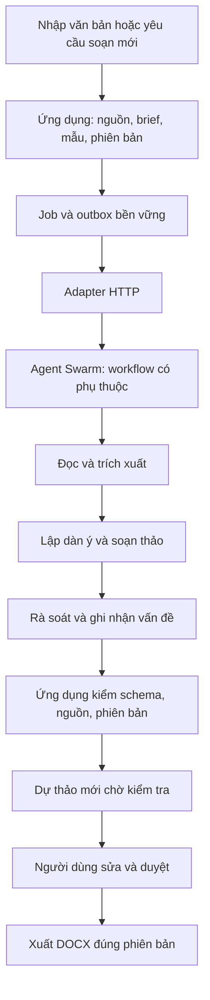

# ADR đề xuất: Agent Swarm xử lý và tạo sinh văn bản

Ngày 09/09/2026. Trạng thái: thiết kế để triển khai theo giai đoạn; chưa tích hợp runtime. Anh Nguyen Hong Khang đã chốt: **xử lý văn bản và có khả năng tạo sinh văn bản mới**, không phải Swarm điều phối đội lập trình. Loại văn bản ưu tiên còn đang hỏi; hợp đồng dưới đây không phụ thuộc vào lựa chọn đó.

## 1. Quyết định kiến trúc đề xuất

Giữ ứng dụng Python làm chủ tài liệu, nguồn, phiên bản, DOCX và phê duyệt. Thêm Agent Swarm thành dịch vụ điều phối tác vụ riêng, kết nối qua adapter HTTP; không nhập mã TypeScript của Swarm vào ứng dụng và không dùng DB Swarm thay DB nghiệp vụ.

Hai hành trình:
- **Xử lý văn bản đến:** nhập nguồn → đọc/OCR theo khả năng hiện có → trích xuất dữ kiện, yêu cầu, thời hạn có căn cứ → rà soát → phiếu xử lý → người dùng duyệt.
- **Soạn văn bản mới:** người dùng nhập mục đích, đối tượng nhận, loại văn bản, nguồn và yêu cầu → xác định thông tin thiếu → lập dàn ý → tạo dự thảo → kiểm tra dữ kiện, mâu thuẫn và mẫu → người dùng sửa/duyệt → xuất DOCX dự thảo.

Soạn mới được bắt đầu **không cần có văn bản đến**. Các dữ kiện người dùng cung cấp được lưu thành nguồn brief có phiên bản; không ép người dùng upload TXT giả để có document_id. Khi chưa có số liệu, tên người ký, số văn bản, ngày hoặc căn cứ, để placeholder rõ ràng; không tự tạo dữ kiện để điền đủ mẫu.

Swarm completed chỉ có nghĩa tác vụ AI kết thúc. Nó không có quyền đổi văn bản thành approved. Agent rà soát cung cấp nhận xét, không thay thế phê duyệt của người dùng.

## 2. Vai trò và mô hình thực thi

| Vai trò logic | Đầu vào | Đầu ra |
|---|---|---|
| Tiếp nhận/định tuyến | Brief, nguồn được chọn, loại kết quả | Workflow phù hợp, các trường cần bổ sung |
| Trích xuất | Nguồn đã đọc, parser warnings | Dữ kiện kèm source_id/revision/block_id/quote |
| Soạn thảo | Brief, dữ kiện, mẫu có phiên bản | Các phần nội dung, claims, placeholders |
| Rà soát | Dự thảo và cùng bộ nguồn | Vấn đề, dẫn chứng, đề nghị chỉnh; không quyền duyệt |

Bản đầu dùng workflow định trước và chỉ một tác vụ model hoạt động tại một thời điểm. Vai trò logic có thể chạy tuần tự trên một worker; không cần bốn container/model hoạt động cùng lúc. Hạn chế số vòng sửa (đề xuất tối đa 2), thời gian và token. Không mở cơ chế tự sinh thêm worker vô hạn.

LangGraph hiện tại nếu giữ lại thì chỉ làm chuỗi xử lý nội bộ của worker/module trích xuất. Swarm điều phối giữa các bước; job trong ứng dụng quản lý giao nhận và kết quả nghiệp vụ. Không để ba tầng cùng tự retry độc lập gây nhân đôi công việc.

## 3. Tạo sinh khác với trích xuất

Giữ Extraction/EvidenceValue và validate_evidence hiện có cho trường trích xuất nguyên văn. Thêm schema riêng cho DraftRequest/DraftResult, không bỏ kiểm chứng nguồn để cho phép câu văn mới.

DraftRequest đề xuất:
- draft_id, request_revision, purpose, document_type, audience, user_instructions;
- source_refs (id, revision, hash), template_id, template_revision;
- user_facts với định danh nguồn brief; trường chưa biết được ghi rõ;
- giới hạn đầu ra và phiên bản workflow/schema.

DraftResult đề xuất:
- title, sections[{id, heading, text}];
- claims[{id, section_id, text_span, provenance, evidence_refs}];
- provenance phân biệt source_document, user_brief, generated_proposal;
- placeholders[{field, reason}], review_findings và model/run metadata.

Câu chuyển ý, bố cục và diễn đạt mới được tạo sinh. Số liệu, thời hạn, tên cơ quan, trích dẫn/căn cứ phải nối về nguồn hoặc được đánh dấu chưa xác minh. Agent kiểm tra độc lập vẫn có thể sai; liên kết nguồn hợp lệ không chứng minh suy luận đúng. Giao diện cần cho người dùng đối chiếu.

Phải phát hiện span/claim bị bỏ sót, không coi danh sách claims do model tự khai là bảo đảm đầy đủ. Kết hợp kiểm tra xác định được (số, ngày, mã, placeholder), reviewer và người dùng. Không tuyên bố hệ thống tự chứng nhận tính pháp lý của văn bản.

## 4. Phiên bản và phê duyệt

Tách vòng đời job (queued/dispatched/running/result_ready/failed/cancelled/stale/dispatch_unknown) khỏi vòng đời draft (editing/awaiting_review/approved/rejected). Đây là trạng thái ứng dụng đề xuất, không giả định trùng enum upstream.

- Kết quả tạo sinh không có văn bản nguồn vẫn có draft_id và brief_revision riêng.
- Khi người dùng sửa brief, nguồn hoặc mẫu, tăng revision; kết quả cũ đến muộn bị stale.
- Lưu draft với expected_version, request_revision, hashes nguồn/mẫu và SHA-256 DOCX. Kiểm tra lại các giá trị trong giao dịch/lock tại thời điểm áp dụng kết quả.
- Lần xử lý lỗi/cancel giữ nguyên phiên bản và lịch sử duyệt hiện có; tạo thành công mới sinh phiên bản chờ kiểm tra mới.
- Tạo bản sửa không xóa bản trước. Duyệt chính xác phiên bản/hash; bytes DOCX phải khớp. Swarm không được gọi review().
- Cho lưu bản đang thiếu thông tin để làm tiếp; trước xác nhận cuối phải giải quyết hoặc được người dùng xử lý rõ các placeholder/vấn đề chặn. DOCX luôn phân biệt dự thảo với văn bản đã phát hành; không tự ký hoặc gửi.

## 5. Biên tích hợp, quyền và độ bền

Adapter dùng HTTP Bearer, kiểm schema response theo OpenAPI của phiên bản pin. Tài liệu upstream có POST /api/tasks, GET /api/tasks/{id}; MCP có send-task/dependsOn. Trước code phải kiểm OpenAPI cụ thể để không suy từ tài liệu sang tham số chưa hỗ trợ.

- Job/outbox lưu job_id, dispatch_attempt, remote_task_id, workflow_revision và payload hash.
- Commit outbox trước gửi; không giữ Service.lock trong suốt lời gọi Swarm. Poll kết quả ngoài request UI.
- Không giả định upstream có idempotency. POST timeout sau khi server nhận cần dispatch_unknown và đối soát trước gửi lại. Xác minh khả năng tìm correlation key ở phiên bản pin; nếu không có, thiết kế broker/dedup phù hợp hoặc yêu cầu đối soát, không gửi lại mù quáng.
- Kết quả trùng chỉ áp dụng một lần bằng khóa duy nhất/transaction; lỗi giữa DOCX và DB cần đối soát file mồ côi. Test crash trước/sau từng mốc.
- DB Swarm riêng. Worker không được mount data/ hoặc truy cập SQLite của ứng dụng. Cấp nguồn theo job/document đã chọn, tối thiểu cần thiết, có thời hạn.
- MCP hiện tại chỉ stdio/in-memory và read_document chưa ràng buộc job. Không mở nguyên MCP này ra LAN. Cần bridge read-only có xác thực/job scope hoặc gửi snapshot nguồn đã cho phép trong payload tác vụ.
- Tắt khả năng shell/ghi file/network không cần của worker nghiệp vụ bằng cấu hình thực thi và hạn chế container, không chỉ bằng prompt. Không dùng nguyên cấu hình mẫu YOLO=true.
- Nguồn văn bản là dữ liệu, không phải chỉ dẫn thực thi. Kiểm prompt injection bằng mẫu giả chứa yêu cầu đọc secrets, đổi quyền duyệt và gửi dữ liệu.
- Swarm lỗi/tắt vẫn dùng được đường lập phiếu thủ công hiện có. UI hiển thị việc đang đợi/lỗi/hủy và không treo.

## 6. Local model và tài nguyên — cổng nghiệm thu đầu tiên

Ràng buộc dự án hiện tại: xử lý nguồn nghiệp vụ local, không fallback cloud. Việc dùng Swarm self-hosted không thay đổi ràng buộc này.

Upstream commit khảo sát `dcaf48b4c0c7604be3e70a0b98596b7231a6a0ea`, package version 1.142.0. Tài liệu gateway mô tả pi/opencode qua OPENROUTER_BASE_URL tới endpoint tương thích GET /models và POST /chat/completions. Đây là **ứng viên** nối gateway local/Ollama, chưa phải bằng chứng hoạt động end-to-end với model đang có. Không áp dụng biến này cho Claude/Codex vì tài liệu nói nó không chuyển endpoint của các harness đó.

Phải thử: model discovery, tool calling, structured output, kết thúc task, giới hạn context, model ID, summaries và embeddings. Không cung cấp cloud credential cho worker dữ liệu nghiệp vụ; tắt hoặc cấu hình local toàn bộ đường gọi phụ. Chạy ca thử khi chặn egress sau khi tải/cài đủ dependency để kiểm chứng không gửi nguồn ra ngoài.

Máy đo ngày 09/09: RAM 7.1 GiB, available khoảng 2.2 GiB, swap đã dùng 962 MiB. Không thấy Docker trong PATH; chưa cài Docker trong phiên này. Chưa có benchmark Swarm hoặc inference thật của hệ thống. Không hứa chất lượng tạo sinh hành chính với model 0.6B đang cấu hình.

PoC tách biệt: API Swarm, storage riêng, một worker nếu khả thi; agent-fs/MinIO và tích hợp ngoài không cần có thể bỏ theo hướng dẫn upstream. Bind cổng host 127.0.0.1; container nối gateway trong mạng riêng, không tùy tiện mở Ollama ra LAN. Windows cần khảo sát runtime Linux container riêng; không suy từ khả năng chạy Python native sang khả năng chạy cả Swarm.

Nếu tài nguyên hoặc chất lượng không đạt, báo số đo và phương án phần cứng/model; không âm thầm chuyển nguồn sang cloud. Mô hình triển khai code đề xuất: Claude Opus hoặc GPT-6 Astra/high cho hợp đồng API, phiên bản và concurrency; đây không phải lựa chọn model xử lý văn bản trong sản phẩm.

## 7. Giao việc và thứ tự PR

Claude hiện giữ service.py/web.py sửa QA theo Issue #5; PR #6 và #7 còn mở lúc khảo sát, local HEAD d14fb5c. Không triển khai trùng các file này trước khi nhánh QA ổn định. Thiết kế này là một nhánh docs riêng từ main `822ce303093ebd8b0ca0a9dd20a67f60f80d8050`.

| Giai đoạn | Giao việc | Bằng chứng nghiệm thu |
|---|---|---|
| S0 — PoC local | Pin upstream/image; xác minh harness/gateway; một task tạo JSON rồi soạn đoạn giả lập | Task thật hoàn tất, model thật được ghi rõ, không egress nguồn, số đo RAM/thời gian; báo fail trung thực |
| S1 — Hợp đồng và lưu trữ | DraftRequest/DraftResult, nguồn brief, revisions, job/outbox và migration | Tạo draft không cần upload; restart không mất job; lỗi không đổi trạng thái duyệt; migration và rollback |
| S2 — Adapter Swarm | Dispatch, poll, cancel, dedup, timeout, stale result | Contract tests + integration test với Swarm thật; mỗi kết quả chỉ tạo tối đa một phiên bản |
| S3 — Xử lý và tạo sinh | Workflow trích xuất/soạn/rà soát; mẫu phiên bản hóa | Trường trích xuất giữ kiểm nguyên văn; văn bản mới có nguồn/placeholder; bounded repair |
| S4 — UI và DOCX | Chọn loại, yêu cầu, nguồn; xem tiến độ; sửa, đối chiếu, duyệt, xuất | Thử trình duyệt end-to-end; DOCX đúng bản/mẫu; sửa bytes bị chặn duyệt; lỗi/hủy không làm mất bản cũ |
| S5 — Pilot | Bộ 30–50 mẫu khử nhạy cảm, gồm soạn mới từ brief | Chấm theo trường và tài liệu; đo công sửa, thời gian/RAM; người dùng nghiệm thu mẫu |

Tài liệu hiện tại không yêu cầu Claude bỏ dở QA. S0 có thể khảo sát tách biệt; các bước sửa service/schema phụ thuộc QA-03/04 và xử lý đúng migration hiện hành. Mỗi PR ghi nhánh/base, file sở hữu, test, giới hạn và rollback; người dùng merge. Không đặt lịch tự chạy hoặc bật worker khi chưa có cấu hình triển khai cụ thể.

## 8. Ca nghiệm thu bắt buộc

1. Nguồn có yêu cầu rõ → phiếu đúng nguồn; scan chưa OCR tiếp tục bị chặn ở tầng service.
2. Brief không có tài liệu đính kèm → dự thảo mới có cấu trúc; thiếu dữ kiện hiện placeholder.
3. Hai nguồn mâu thuẫn → báo cần kiểm tra, không tự chọn như sự thật đã xác nhận.
4. Model bịa số/ngày/căn cứ hoặc thiếu dẫn chứng → ghi nhận vấn đề chặn/đối chiếu; không tự duyệt.
5. Sửa brief/source/template lúc task đang chạy → kết quả đến muộn không ghi đè.
6. POST timeout, result lặp, restart, cancel → không tạo bản trùng; giữ lịch sử và trạng thái duyệt.
7. Swarm/model không sẵn sàng → báo lỗi cụ thể, UI và lập phiếu thủ công còn dùng được.
8. Worker yêu cầu dữ liệu ngoài job hoặc gọi approve → bị từ chối bằng cơ chế thực thi.
9. Sửa DOCX sau lưu → không duyệt được; thay đổi nội dung luôn tạo revision mới.
10. Ca thật với local model và egress bị chặn; báo cáo riêng test mock, inference thật và đánh giá nghiệp vụ.

## 9. Nguồn khảo sát

- https://github.com/desplega-ai/agent-swarm/blob/dcaf48b4c0c7604be3e70a0b98596b7231a6a0ea/README.md
- https://github.com/desplega-ai/agent-swarm/blob/dcaf48b4c0c7604be3e70a0b98596b7231a6a0ea/MCP.md
- https://github.com/desplega-ai/agent-swarm/blob/dcaf48b4c0c7604be3e70a0b98596b7231a6a0ea/docker-compose.example.yml
- https://github.com/desplega-ai/agent-swarm/blob/dcaf48b4c0c7604be3e70a0b98596b7231a6a0ea/skills/agent-swarm/references/components.md
- https://github.com/desplega-ai/agent-swarm/blob/dcaf48b4c0c7604be3e70a0b98596b7231a6a0ea/skills/agent-swarm/references/usage.md
- https://github.com/desplega-ai/agent-swarm/blob/dcaf48b4c0c7604be3e70a0b98596b7231a6a0ea/docs-site/content/docs/(documentation)/guides/provider-auth/model-gateways.mdx
- https://github.com/hongkhang21998-creator/tro-ly-van-ban/pull/7

Nhật ký phiên kiến trúc: chỉ thêm tài liệu này, không sửa src/tests/schema/runtime/data hoặc WORKLOG đang nằm trên nhánh Claude. Phạm vi và bàn giao được ghi trong tài liệu và PR riêng để tránh giẫm chân. Không tuyên bố tích hợp đã chạy hoặc Claude đã bắt đầu thực hiện.
